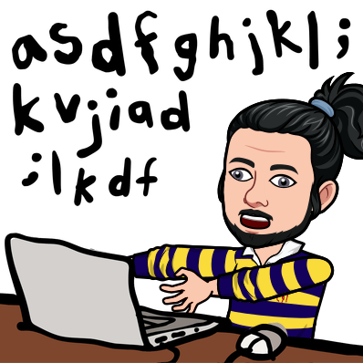

### < Hello World /> 

My name's Simran Shrivastava, currently a third year student pursuing B.Tech from SRM Institute of Science and Technology in the field of Computer Science. Currently, I am an web developer enhancing my skills using JavaScript.  

- 🌱 I’m currently learning - React Native and JavaScript
- 👯 I’m looking to collaborate on - Development or Open source projects
- 💬 Ask me about - Python, C/C++,HTML, CSS, JavaScript
- 😄 Pronouns: She/They
- 📫 Let's Connect:  

  
  
   

## Languages/Systems/Tools

 
</a>
</a> 
</a> 
</a>  
</a>     
</a>  
</a>    
</a>  
</a>  

<!--  

  
 

  -->
<h2 align="center">Stats: </h2>

 
  
  
  

  

<!--
**aryamanshrivastava/aryamanshrivastava** is a ✨ _special_ ✨ repository because its `README.md` (this file) appears on your GitHub profile.

Here are some ideas to get you started:

- 🔭 I’m currently working on ...
- 🌱 I’m currently learning ...
- 👯 I’m looking to collaborate on ...
- 🤔 I’m looking for help with ...
- 💬 Ask me about ...
- 📫 How to reach me: ...
- 😄 Pronouns: ...
- ⚡ Fun fact: ...
-->
